# Отчет по практической работе №1: Конечные автоматы

|                |                                       |
|----------------|---------------------------------------|
| **Дисциплина** | Теория автоматов, языков и вычислений |
| **Тема**       | Конечные автоматы                     |
| **Вариант**    | № 1                                   |
| **Выполнил**   | Грушевский И. А. КИ24-16/1Б           |
| **Проверил**   | Кузнецов А. С.                        |

---

**Цель:** Реализация и исследование детерминированных и недетерминированных конечных автоматов.

**Постановка задачи (Вариант 1):**
1. **Часть а (ДКА):** построить ДКА, допускающий в алфавите $\{a, b\}$ все строки с количеством символов $a$, не превышающим 3.
2. **Часть б (НКА):** построить НКА, допускающий цепочки в алфавите $Z = \{1, 2, 3\}$, у которых последний символ цепочки уже появлялся в ней раньше, например $w = 12321$.

---

## ДКА
### Описание автомата
* Алфавит: $\{a, b\}$ 
* Множество состояний: $\{q0, q1, q2, q3, q4\}$
* Множество допускающих состояний: $\{q0, q1, q2, q3\}$
* Начальное состояние: $q0$

### Таблица переходов
| Состояние  | Символ $a$ | Символ $b$ |
|:----------:|:----------:|:----------:|
| $\to *q_0$ |   $q_1$    |   $q_0$    | 
|   $*q_1$   |   $q_2$    |   $q_1$    |
|   $*q_2$   |   $q_3$    |   $q_2$    |
|   $*q_3$   |   $q_4$    |   $q_3$    |
|   $q_4$    |   $q_4$    |   $q_4$    |

### Граф переходов ДКА

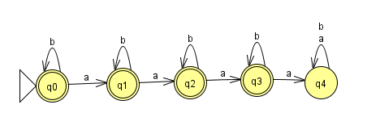

### Трассировка и результаты тестирования

**Результаты множественного тестирования (JFLAP Multiple Run):**  
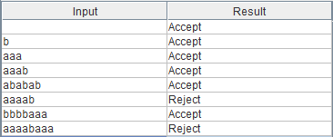

### Пошаговое выполнение процесса распознавания цепочек:

#### Распознавание допустимой цепочки `aaab` (Accept):
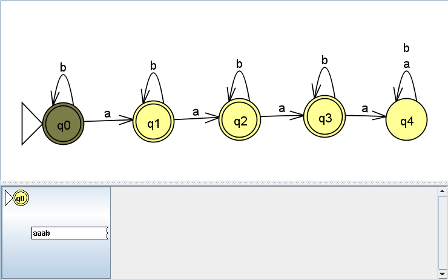
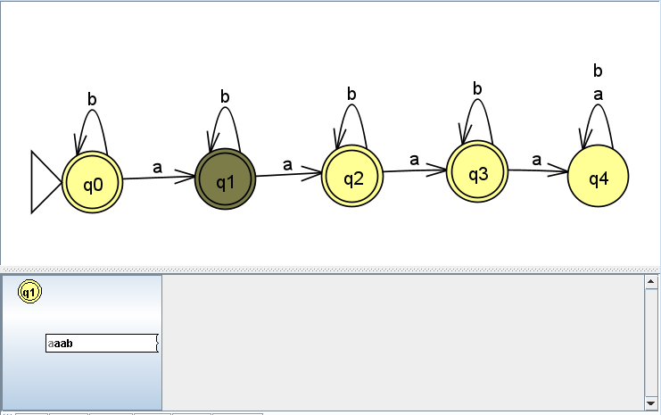
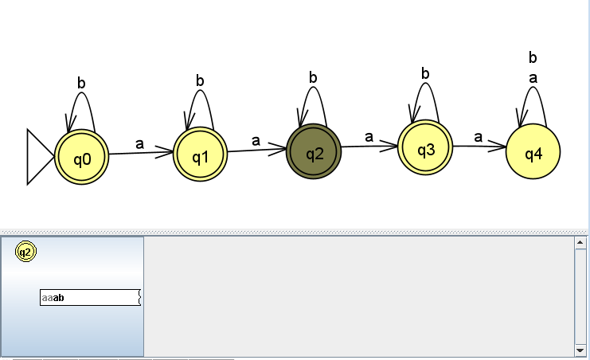

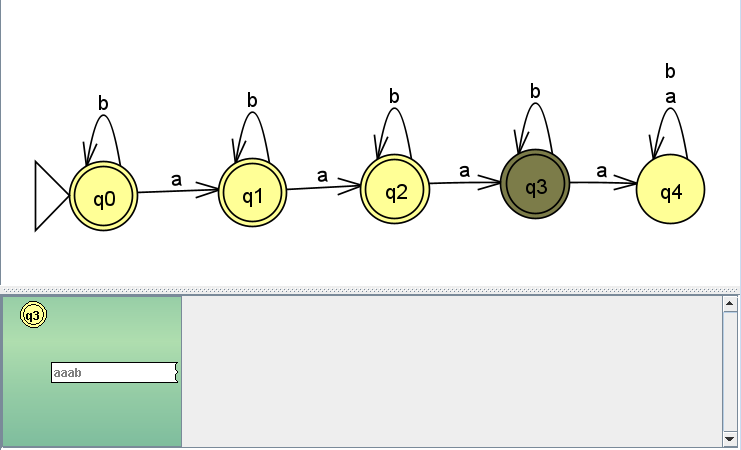

#### Распознавание недопустимой цепочки `aaaab` (Reject):
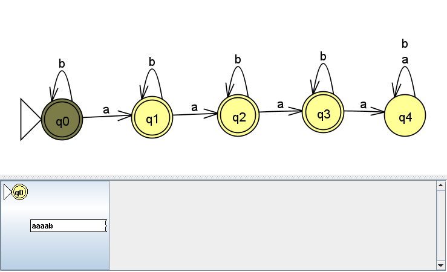
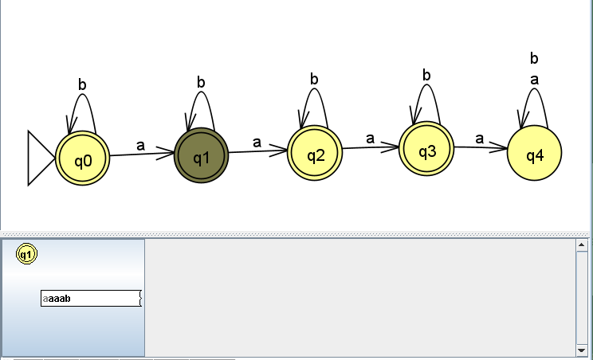
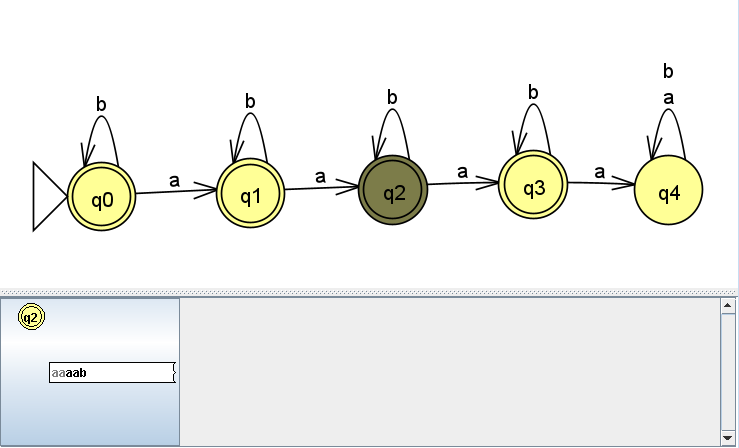
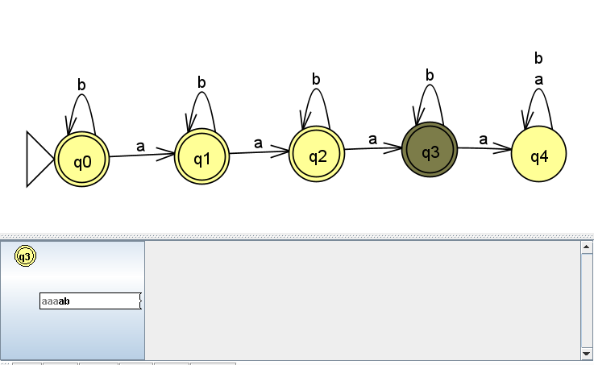

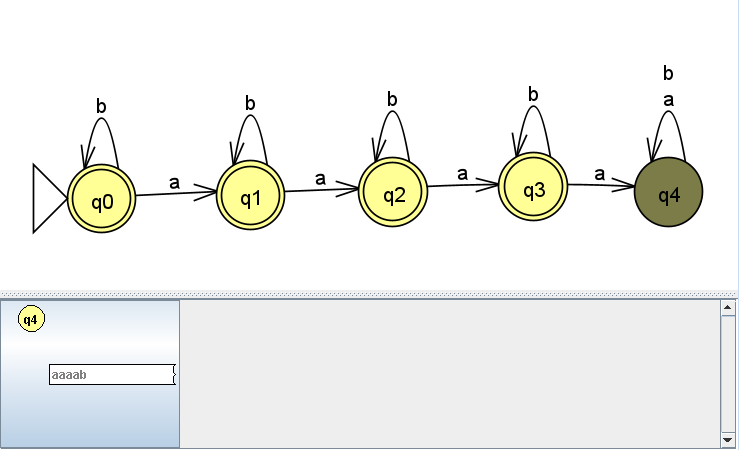
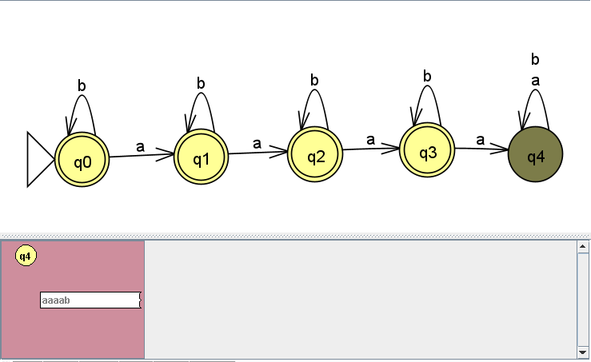

---
## НКА
* Алфавит: $\{1, 2, 3\}$ 
* Множество состояний: $\{q0, r1, r2, r3, f1, f2, f3\}$
* Множество допускающих состояний: $\{f1, f2, f3\}$
* Начальное состояние: $q0$

### Таблица переходов

| Состояние |   Символ $1$   |   Символ $2$    |   Символ $3$   |
|:---------:|:--------------:|:---------------:|:--------------:|
| $\to q_0$ | $\{q_0, r_1\}$ | $\{q_0, r_2\}$  | $\{q_0, r_3\}$ |
|   $r_1$   | $\{r_1, f_1\}$ |    $\{r_1\}$    |   $\{r_1\}$    |
|   $r_2$   |   $\{r_2\}$    | $\{r_2, f_2\}$  |   $\{r_2\}$    |
|   $r_3$   |   $\{r_3\}$    |    $\{r_3\}$    | $\{r_3, f_3\}$ |
|  $*f_1$   |  $\emptyset$   |   $\emptyset$   |  $\emptyset$   |
|  $*f_2$   |  $\emptyset$   |   $\emptyset$   |  $\emptyset$   |
|  $*f_3$   |  $\emptyset$   |   $\emptyset$   |  $\emptyset$   |

### Граф переходов НКА
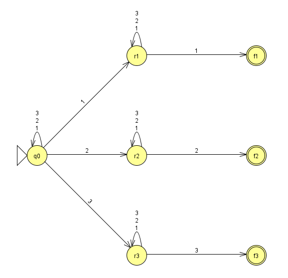

### Трассировка и результаты тестирования

**Результаты множественного тестирования (JFLAP Multiple Run):**  
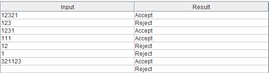

### Пошаговое выполнение процесса распознавания цепочек:

#### Распознавание допустимой цепочки `1231` (Accept):
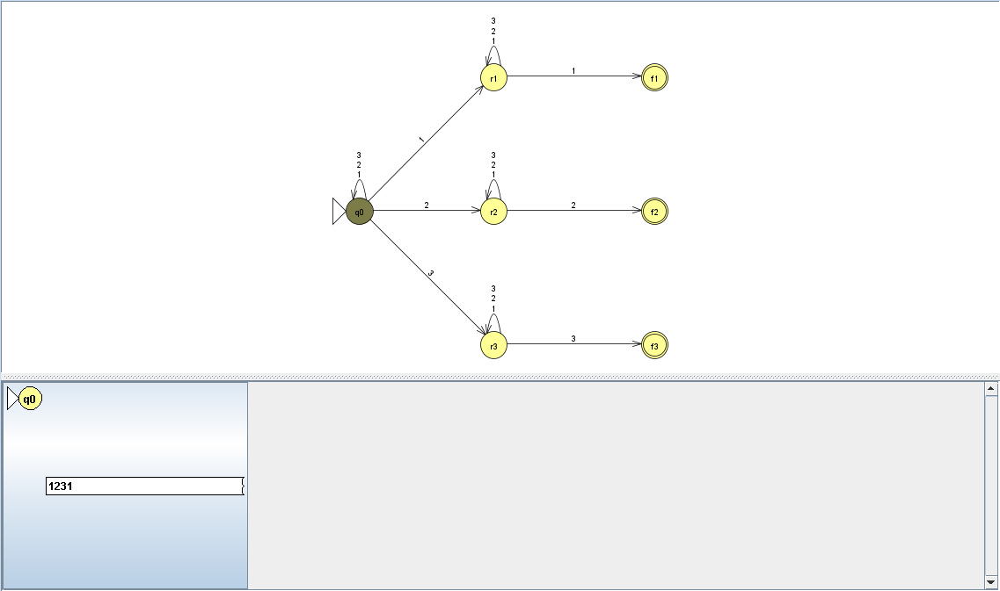
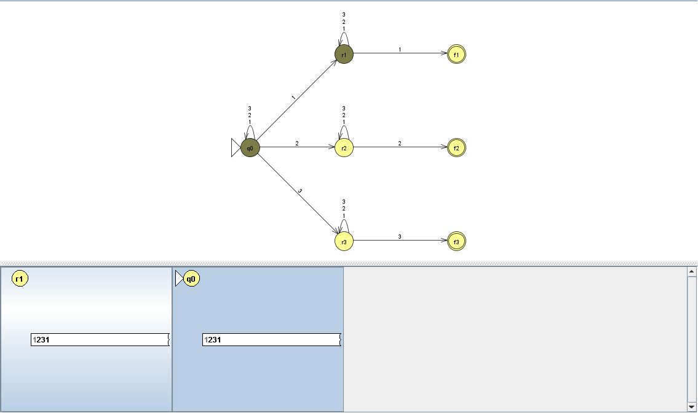
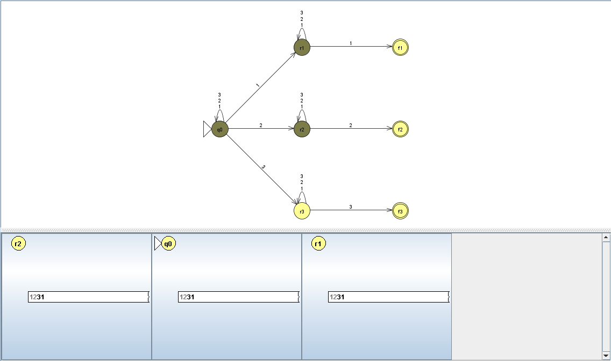
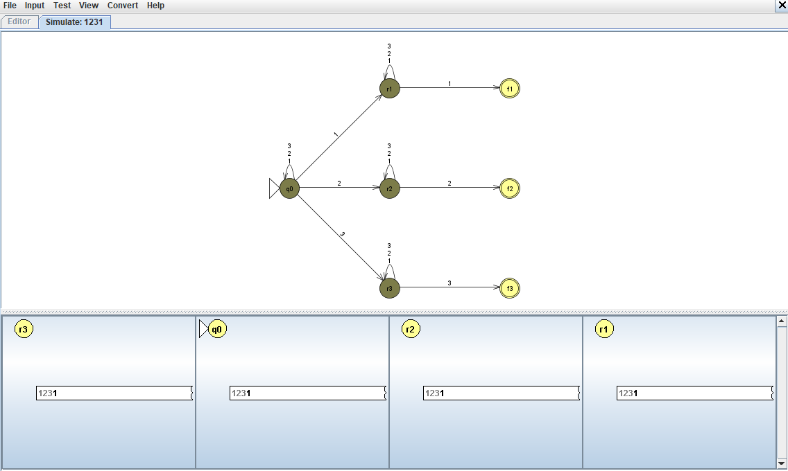
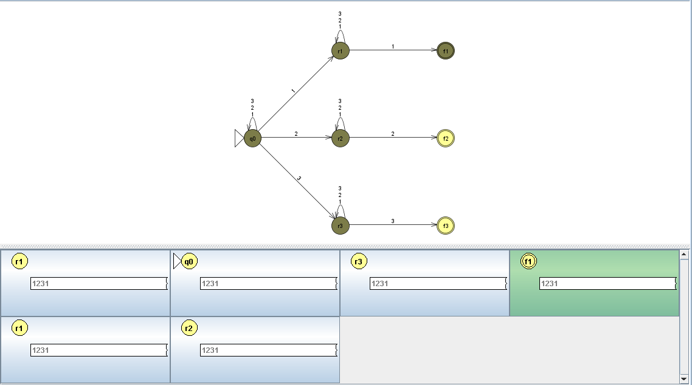
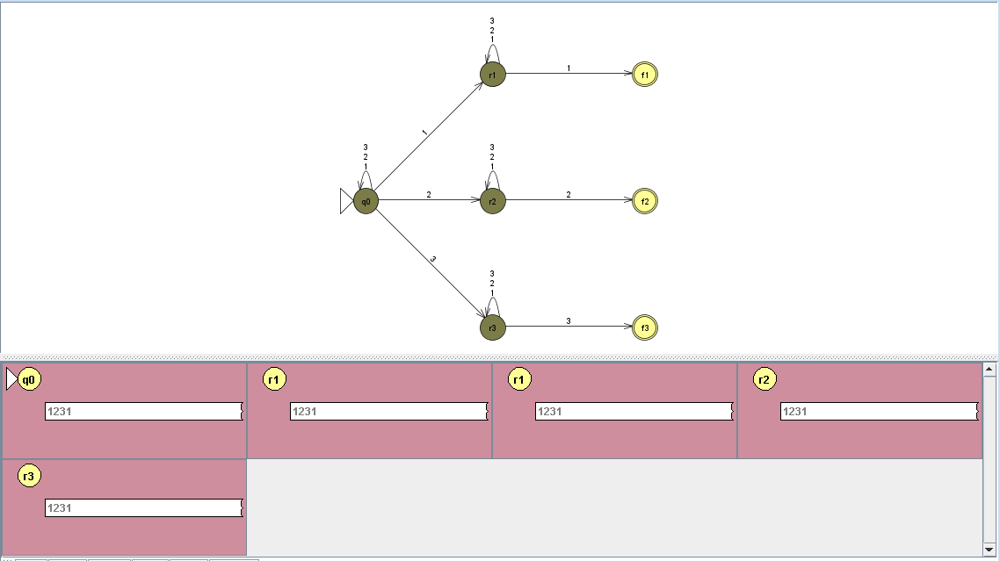

#### Распознавание недопустимой цепочки `123` (Reject):
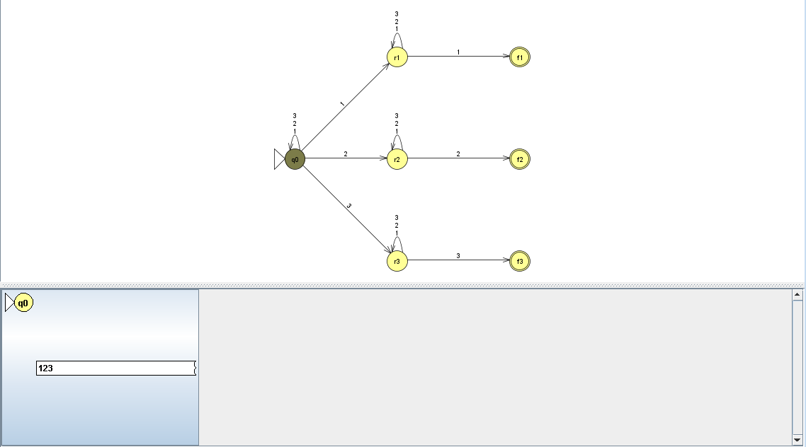
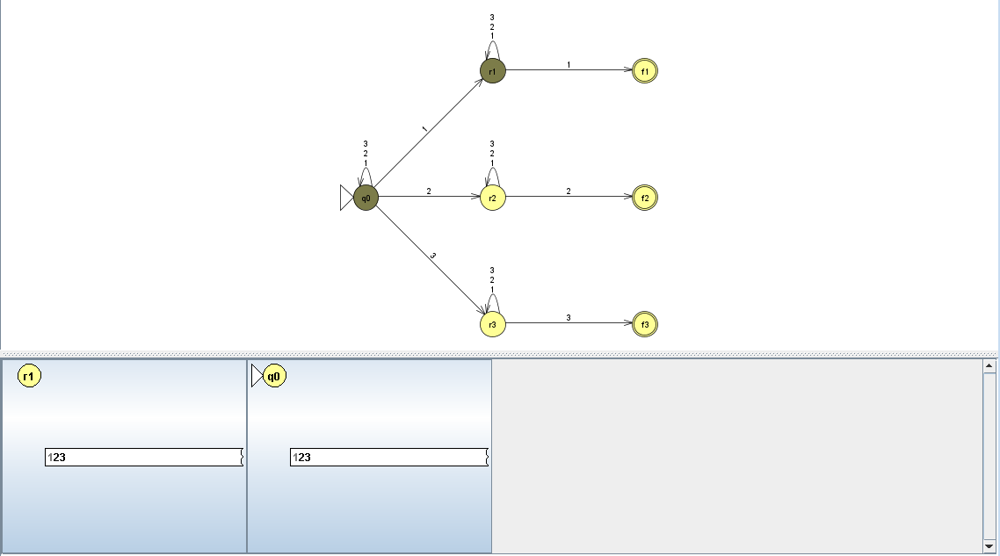
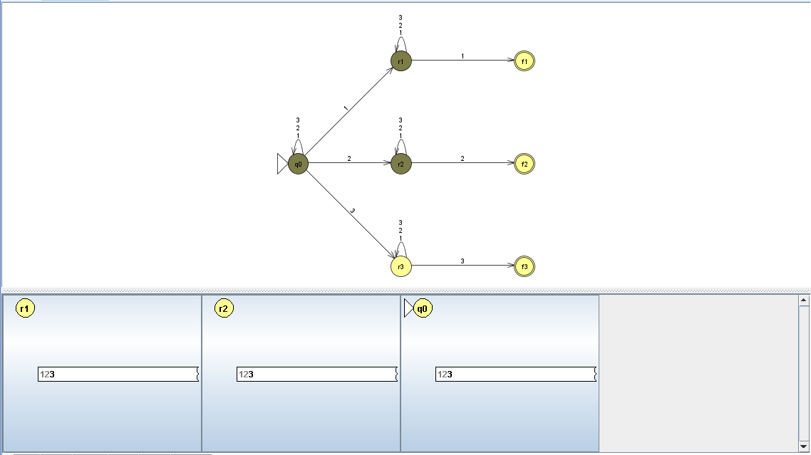
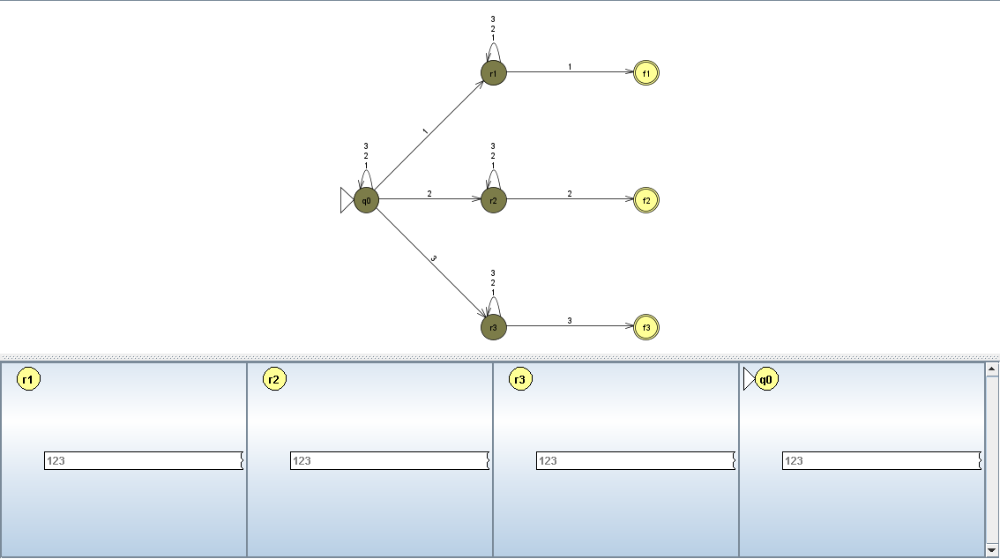
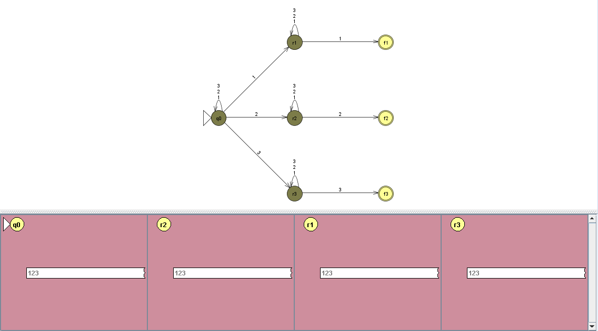

---
## Вывод
В ходе работы были построены и проанализированы ДКА и НКА в программе JFLAP, а также выполнена их программная реализация на языке Python.